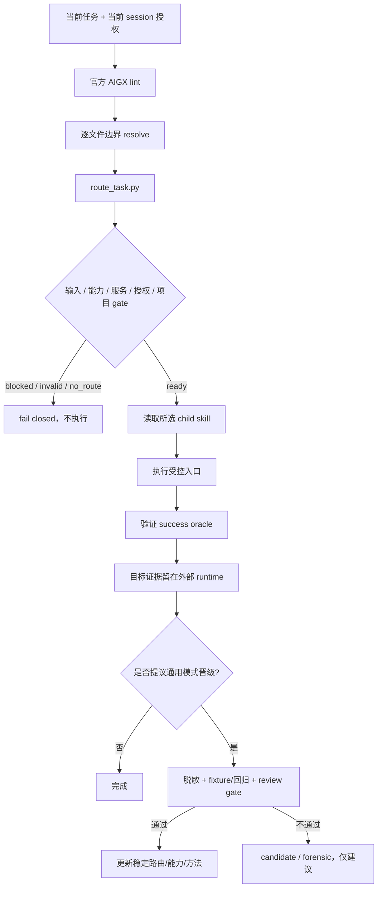

# 系统架构

## 规范执行链

`.aigx/` 是项目规则与文件边界的唯一规范来源。`RULES.md`、`RULES_zh.md` 和 `kali/RULES-kali.md` 只是兼容启动桥；它们不复制 genome，也不写入客户端全局配置。

## 组件边界

| 层 | 主要文件 | 职责 |
|---|---|---|
| 上下文 | `.aigx/*.aigx` | 稳定项目规则、concerns 与编辑边界 |
| 路由 | `skills/scripts/route_task.py`, `skills/routing.json`, `reverse_skill/routing.py` | 确定性选路、preflight、受控 dispatch |
| 案件 | `reverse_skill/case.py`, `reverse_skill/data/case-contracts.json` | case init/review：scope 契约、network 归一化、SHA-256 fixity、路径逃逸 fail-closed |
| 项目索引 | `reverse_skill/index_*.py`, `reverse_skill/retrieval.py` | SQLite 单一真相、Markdown 树/Python AST、BM25/tree/hybrid 检索与 provider-neutral API |
| 门禁 | `reverse_skill/gates.py`, `reverse-skill gates` | leak-scan / doc-facts / version / routing-coherence（纯 Python，无 PowerShell 门禁） |
| 能力 | `refresh_ida_capabilities.py`, manifests, tool discovery | 区分 installed、compatible、loaded、verified |
| 工作流 | `skills/*/SKILL.md` | 具体逆向、安全、协作与报告流程 |
| 运行时 | 仓库外 session/worktree/lab | 目标路径、凭据、IDB、trace、可变证据 |
| 进化 | `skills/evolution/`, `field-journal/{candidate,validated,forensic}` | 仅承载目标无关、脱敏、经 gate 的通用模式 |

## Python 质量门禁

仓库门禁全部由 Python 实现并通过 `reverse-skill gates` 调用（CI 亦如此）：

- `gates leak-scan`：field-journal / promotion 候选的敏感信息扫描（IP/邮箱/手机/JWT/密钥）
- `gates doc-facts`：README/OpenCLI/CLI 命令面与打包数据（`reverse_skill/data/*.json`）漂移检查
- `gates version`：pyproject / 包版本 / OpenCLI / CHANGELOG 一致性
- `gates routing-coherence`：`skills/routing.json` 合法性、被引用 skill 路径存在性、crosswalk 引用存在性
- `gates all`：聚合全部门禁

PowerShell 只保留为 Windows 系统壳（`ENG-python-primary`）；本仓库不再分发项目 PowerShell
脚本，PowerShell 不作为项目入口、路由器、适配器或质量门禁。

## 长项目索引与检索

项目索引落在目标工作区的 `.reverse-skill/index/v1.sqlite3`，它是可重建的本机状态，不进入
Git。数据库同时保存文档、结构节点、父子/Markdown 链接边和 FTS5 `unicode61` / `trigram`
索引；不存在并行 manifest，也不依赖向量数据库、云服务或模型调用。

- Markdown：按 ATX 标题构建确定性树，代码围栏内标题不参与解析；重复同名节点使用转义
  identity segment 和 `@N` 后缀，保持结构路径与 node ID 唯一。
- Python：标准库 AST 提取 module/class/function/async function；语法失败显式退回文件节点。
- 其他文本：只建立文件级节点。本 Beta 不宣称 Tree-sitter、SCIP 或跨语言语义索引能力。
- `bm25`：FTS5 排名；短查询走精确结构匹配和有界字面量扫描。
- `tree`：按 node ID、tree path、标题定位并返回祖先和有界子节点。
- `hybrid`：合并 FTS shortlist 与树扩展，返回可解释分数组件；不是向量混合检索。

`reverse_skill.index_api` 是 CLI 与未来 MCP adapter 的共同入口。本批次只冻结并实现
provider-neutral Python API，不内置第二个 MCP server，避免协议面与检索实现重复。

## 多平台

Windows 与 Kali 共用同一 AIGX genome、router、routing data 和 child skills。平台差异只位于能力发现与安装脚本：

| 环境 | 启动桥 | 工具脚本 |
|---|---|---|
| Windows | `RULES.md` | Python 主链（`reverse_skill/`、`reverse-skill` CLI），无项目 PowerShell 脚本 |
| Kali Linux | `kali/RULES-kali.md` | `kali/scripts/*.sh` |

PowerShell 只作为 Windows 系统壳使用（用户手动跑命令）；本仓库**不再分发任何项目 PowerShell
脚本**（入口、路由器、适配器、门禁均已 Python 化）。`kali/scripts/*.sh` 是 Kali 侧兼容面，
同样不参与受控路由执行。

平台 bootstrap 不能绕过 route gate。缺少工具时 route 应显式 blocked；安装或外部服务启动必须仍符合当前任务权限与副作用边界。

## IDA 与协作

- IDA/idalib wrapper 只接受真实文件输入；目录、缺失路径和不可用 runtime 都 fail closed。
- plugin capability 将静态兼容、运行时加载与动作验证分开记录。
- IDA Teams 的仓库/合同/worktree 管理可独立 preflight。
- Teams 与真实二进制分析的复合请求在尚无完整多阶段执行器时返回 `composite_workflow_not_supported`，不会 false-ready。
- dirty 源仓先复制到仓库外隔离 lab；不修改目标二进制、IDA 主配置或源码基线。

## 结构证据

项目结构真相来自目标项目自己的 AIGX 边界与发布的 Code Intel/Sentrux 结果。结构 gate 必须使用 AIGX resolve 得到的 scope；缺失或多值时阻塞，绝不退回全仓 root，也不保存新 baseline 掩盖退化。
