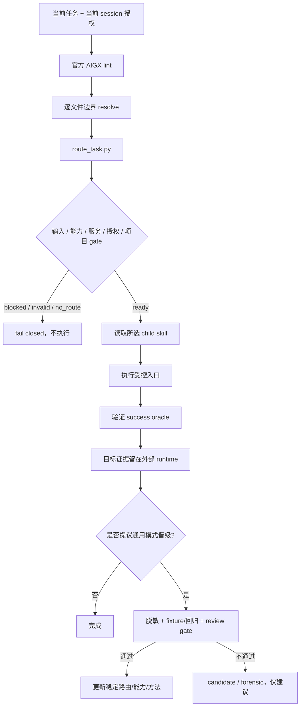

# 系统架构

## 规范执行链

`.aigx/` 是项目规则与文件边界的唯一规范来源。`RULES.md`、`RULES_zh.md` 和 `kali/RULES-kali.md` 只是兼容启动桥；它们不复制 genome，也不写入客户端全局配置。

## 组件边界

| 层 | 主要文件 | 职责 |
|---|---|---|
| 上下文 | `.aigx/*.aigx` | 稳定项目规则、concerns 与编辑边界 |
| 路由 | `skills/scripts/route_task.py`, `skills/routing.json` | 确定性选路、preflight、受控 dispatch |
| 能力 | `refresh_ida_capabilities.py`, manifests, tool discovery | 区分 installed、compatible、loaded、verified |
| 工作流 | `skills/*/SKILL.md` | 具体逆向、安全、协作与报告流程 |
| 运行时 | 仓库外 session/worktree/lab | 目标路径、凭据、IDB、trace、可变证据 |
| 进化 | `skills/evolution/`, `field-journal/{candidate,validated,forensic}` | 仅承载目标无关、脱敏、经 gate 的通用模式 |

## 多平台

Windows 与 Kali 共用同一 AIGX genome、router、routing data 和 child skills。平台差异只位于能力发现与安装脚本：

| 环境 | 启动桥 | 工具脚本 |
|---|---|---|
| Windows | `RULES.md` | `skills/scripts/*.ps1` 与 Python wrappers |
| Kali Linux | `kali/RULES-kali.md` | `kali/scripts/*.sh` |

平台 bootstrap 不能绕过 route gate。缺少工具时 route 应显式 blocked；安装或外部服务启动必须仍符合当前任务权限与副作用边界。

## IDA 与协作

- IDA/idalib wrapper 只接受真实文件输入；目录、缺失路径和不可用 runtime 都 fail closed。
- plugin capability 将静态兼容、运行时加载与动作验证分开记录。
- IDA Teams 的仓库/合同/worktree 管理可独立 preflight。
- Teams 与真实二进制分析的复合请求在尚无完整多阶段执行器时返回 `composite_workflow_not_supported`，不会 false-ready。
- dirty 源仓先复制到仓库外隔离 lab；不修改目标二进制、IDA 主配置或源码基线。

## 结构证据

项目结构真相来自目标项目自己的 AIGX 边界与发布的 Code Intel/Sentrux 结果。结构 gate 必须使用 AIGX resolve 得到的 scope；缺失或多值时阻塞，绝不退回全仓 root，也不保存新 baseline 掩盖退化。
