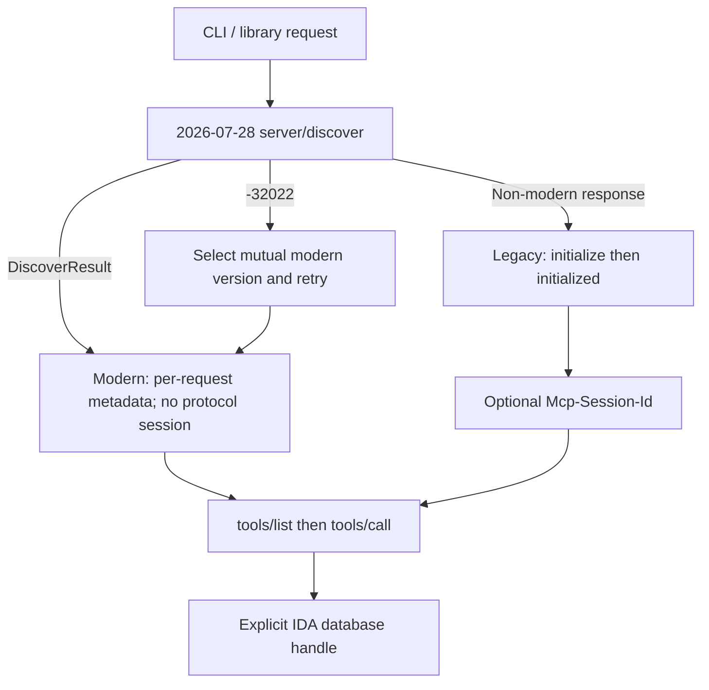

# MCP 2026-07-28 双时代接入记录

验证日期：2026-08-11。

## 结论

`reverse-skill.ps1` 的 HTTP 客户端采用 dual-era：先按 MCP `2026-07-28` 发 `server/discover`；识别到现代错误时留在现代时代并协商版本，其他响应才进入 legacy `initialize`。不能把“客户端支持新版”写成“当前 IDA 服务端已运行新版”。



IDA database ID 是工具参数里的应用层句柄，不是协议会话；现代协议删除 `Mcp-Session-Id` 不影响显式 database 路由。

## 实现边界

- 现代请求的 `params._meta` 固定携带协议版本、客户端身份和客户端能力；HTTP 同步镜像版本、方法、名称及 `x-mcp-header` 参数头。
- `Mcp-Name` 与参数头对非 ASCII、控制字符、首尾空白和 sentinel 形状做 UTF-8 Base64 sentinel 编码。
- `tools/list` 保留 `ttlMs` / `cacheScope`；非法、重复、非 primitive 或非静态 `properties` 路径的 `x-mcp-header` 定义会被排除。
- MRTR 的 `input_required` 原样返回。重试由 `-InputResponsesJson` 和 `-RequestState` 显式提供；不透明状态不解析、不改写，每次调用生成新的 JSON-RPC id。
- CLI 不声明 roots、sampling 或自动 elicitation 能力；没有实际交互实现的能力不能冒充已支持。
- 现代模式不发 `initialize`、`notifications/initialized` 或 DELETE；legacy 模式保留这些生命周期行为。

## 本机证据

```text
IDA: 9.4.260714.951, C:\Program Files\IDA Professional 9.4
Python package: ida-pro-mcp 2.0.0
Server self-report: ida-pro-mcp 1.0.0
Negotiated era/version: legacy / 2025-06-18
Discovered tools: 66
Codex registration: idapro -> http://127.0.0.1:13337/mcp, enabled
```

已安装包来自 commit `2ca65ed8f505c912bb921fd8873e7d757bdf627b`；检查上游 `main` 的 `0b5f7ae4026d3c770b190ca93c0692d1b0ceab22` 后，服务仍显式使用 `2025-06-18` 和 `Mcp-Session-Id`。因此盲目升级 Python 包不能让链路变成 `2026-07-28`，本轮没有为协议名义改动全局包。

## 规范依据

- [Versioning and Compatibility](https://modelcontextprotocol.io/specification/2026-07-28/basic/versioning)
- [Discovery](https://modelcontextprotocol.io/specification/2026-07-28/server/discover)
- [Streamable HTTP](https://modelcontextprotocol.io/specification/2026-07-28/basic/transports/streamable-http)
- [Multi Round-Trip Requests](https://modelcontextprotocol.io/specification/2026-07-28/basic/patterns/mrtr)
- [Schema Reference](https://modelcontextprotocol.io/specification/2026-07-28/schema)
- [ida-pro-mcp upstream legacy transport at inspected commit](https://github.com/mrexodia/ida-pro-mcp/blob/0b5f7ae4026d3c770b190ca93c0692d1b0ceab22/src/ida_pro_mcp/ida_mcp/zeromcp/mcp.py#L480-L542)

## 本轮工具链经验

1. PowerShell 5.1 / 7 只是系统壳和 CLI 宿主，不应登记为逆向能力；真实链路是 `reverse-skill.ps1 -> HTTP MCP -> idalib-mcp.exe -> IDA`。
2. “最新版”分三层核对：IDA 安装版本、Python 包元数据、服务端实际协商协议。任一层的版本号都不能代替另外两层。
3. 服务端 `serverInfo.version` 是自报展示字段；本机包为 `2.0.0`，服务仍自报 `1.0.0`，不能混写。
4. 健康检查必须先验证监听和 MCP 工具发现；启动脚本在服务健康时复用进程，避免破坏活跃数据库句柄。
5. PowerShell 脚本调用另一个 `.ps1` 后不能假定 `$LASTEXITCODE` 已存在；应立即检查 `$?`。本轮真实启动验证抓到了这个旧缺陷。
